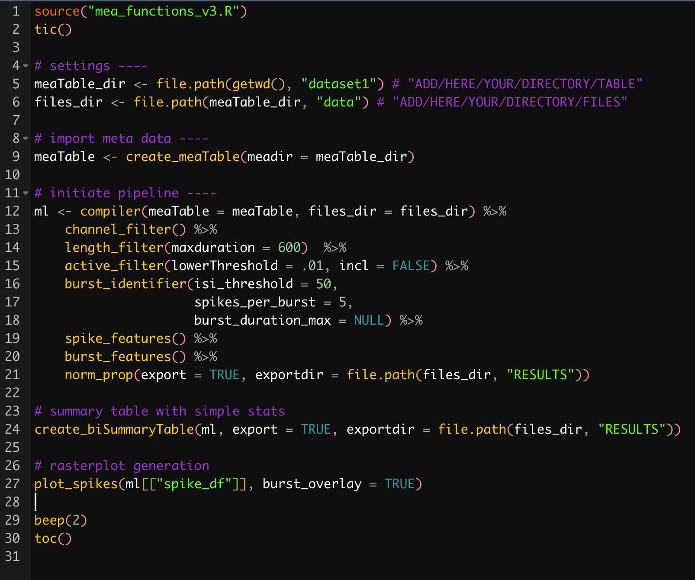

# meaR

## Introduction
Micro-electrode arrays (MEAs) are becoming increasingly popular to investigate activity of neuronal assemblies upon genetic, pharmacological and/or optogenetic manipulation. Neuronal activity can be assessed on acute brain slices, neuronal uniform or mixed-cell cultures, and human pluripotent stem cells, to name a few. It is a means for high-throughput screening and these MEAs come in different sizes, resolution and presets from different companies. However, MEA data in general are very complex, and the output files generated from these MEAs are rarely immediately usable for statistical analysis. As such, a tabular form (<i>i.e.</i>, a dataframe or tibble) is more recommended which also included the required parameters for statistical analyses.

## Purpose
For these reasons, this repository contains a collection of R functions to extract, visualize and analyze MEA data, specifically from <a href = "https://www.multichannelsystems.com/products/vitro-mea-systems">MultiChannel Systems</a>.  
> <b>Note, that the script is in continuous development</b> and earlier versions have been used for the following papers:
>
> - <b>Lo AC</b>, Rajan N, Gastaldo D, Telley L, Hilal ML, Buzzi A, Simonato M, Achsel T, Bagni C (2021). Absence of RNA-binding protein FXR2P prevents prolonged phase of kainate-induced seizures. <i>EMBO Rep</i>. <a href = "http://doi.org/10.15252/embr.202051404 ">[link to article]</a>
> - Dominguez-Iturza N, <b>Lo AC</b>, Shah D, Armendariz M, Vannelli A, Mercaldo V, Trusel M, Li KW, Gastaldo D, Santos AR, Callaerts-Vegh Z, D'Hooge R, Mameli M, Van der Linden A, Smit AB, Achsel T, Bagni C (2019). The autism- and schizophrenia-associated protein CYFIP1 regulates bilateral brain connectivity and behaviour. <i>Nat Commun</i> <b>10</b>: 3454. <a href = "https://www.nature.com/articles/s41467-019-11203-y">[link to article]</a>
>

## Step-by-step guide
### 1. MEA output file
Settings for spike detection threshold are done within the Multi Channel Experimenter Spike Analyzer itself. Data output files are in .txt format. These contain for each separate electrode (N=60) spike data on the occurrence (s), interspike interval (isi in ms) and frequency (in Hz). The electrode ID is the combination of its xy-coordinates (e.g. 12: column 1, row 2).

</img>

### 2. Directory setup
Have one folder that contains (1) an .xlsx meta file called `meaTable.xlsx` (see later) and (2) a folder containing all the .txt data output files.

### 3. Meta file
The <b>meta file</b> `meaTable.xlsx` contains all information of the samples. It contains the animal ID, filename, genotype, recording time (s), as well as sample/channel exclusion criteria. This file has to be filled in by the user before data extraction and processing can begin.

### 4. Import MEA data
Based on the information from the meta file. The respective datafiles will be opened one-by-one and all the spike data is extracted. They are all compiled within a dataframe/tibble that contains key columns for filename, genotype, and electrode ID.

 

> All functions can be found in the `mea_functions.R` file.
>

### 5. Apply filters
- <b>sample filter</b>: This filter excludes these recordings for technical reasons, e.g., contamination. The user has marked these samples to be excluded in the meta file in the column exclude.
- <b>channel filter</b>: This filter excludes particular electrodes for technical reasons, e.g., too noisy. The user has marked these channels in the meta file in the column "channels2exclude". Multiple channels are separated by a comma.
- <b>recording length filter</b>: This filter keeps only data within a user-defined max recording time (in seconds). The user indicates the max recording time for all samples.
- <b>active channel filter</b>: This filter only keeps channels that are active. We define active as having at least a spike rate of 0.01 Hz.

- custom filters: for region, layer, etc

### 6. Spike features
- <b>spike_n</b>: number of spikes
- <b>sliceSpikeRate</b>: overall spike rate
- <b>spikeRate_mean</b>: average spike rate across all detected/active electrodes
- <b>spikeRate_sd</b>: standard deviation of spike rates across all detected/active electrodes
- <b>isi_mean</b>: average interspike rate across all detected/active electrodes
- <b>isi_sd</b>: standard deviation of interspike rates across all detected/active electrodes

### 7. Burst detection
Burst are detected based on user-defined parameters. As default, we have set that a burst is identified as contain at least 5 spikes, with each being max 50 ms apart from each other. Other parameter includes the max time frame these spikes have to be in.

### 8. Burst features
- <b>burst_n</b>: number of bursts
- <b>isi_inBurst_mean</b>: average interspike rate within a burst across all detected/active electrodes
- <b>isi_inBurst_sd</b>: standard deviation in the interspike rates within a burst across all detected/active electrodes
- <b>bursts_spikes_total</b>: total number of spikes in bursts
- <b>bursts_spikes_mean</b>: average number of spikes in bursts
- <b>bursts_spikes_sd</b>: standard deviation in the number of spikes in bursts
- <b>bursts_spikes_PROP2totalSpikes</b>: proportion of spikes in bursts over all detected spikes
- <b>spikeRate_inBurst_mean</b>: average spike rate during bursts
- <b>spikeRate_inBurst_sd</b>: standard deviation in spike rate during bursts
- <b>ibi_mean</b>: average interburst interval
- <b>ibi_sd</b>: standard deviation in interburst intervals
- <b>burstRate_mean</b>: average burst rate
- <b>burstRate_sd</b>: standard deviation in burst rates
- <b>burst_dur_mean</b>: average duration of bursts
- <b>bursts_dur_sd</b>: standard deviation in burst durations

### 9. Other features
- <b>totalChannels</b>: number of electrodes detected
- <b>activeChannels</b>: number of active electrodes (based on criteria of `active_filter()`)
- <b>activeChannels_PROP2totalChannels</b>: proportion of active electrodes over total electrodes

### 10. Normalization
- <b>spike_n_NORM</b>: normalized number of spikes
- <b>burst_n_NORM</b>: normalized number of bursts

### 11. Summary table
`create_biSummaryTable()` creates a concise table where for each of the parameters listed in steps 6-10 the average value, the sem value as well as the t-test is given between WT and GM (genetically modified) samples. By default, this table is exported to a subfolder called "RESULTS".

### 12. Visualization
- `plot_spikes()`: this function produces a rasterplot with on the x-axis the time and y-axis the different electrodes. Each point represents a spike occurrence. Additional parameters are `burst_overlay` (to color differently the spikes that are part of a burst), `xlim` (the length of the x-axis), `xticks` (to adjust ticks placement on the x-axis) and `size` (how big the points are).
- `plot_cumul_freq()`: this function produces a cumulative frequency plot of the spike or burst rate between genotypes. A Kolmogorov-Smirnov test is also applied to check whether these distributions in spike or burst rates are significantly different. `type` parameter allows to toggle between spikes and bursts.

### 13. Pipeline
All the aforementioned steps are separate functions, but these are all provided together as a processing pipeline template in `mea_pipeline.R`.

</img>
